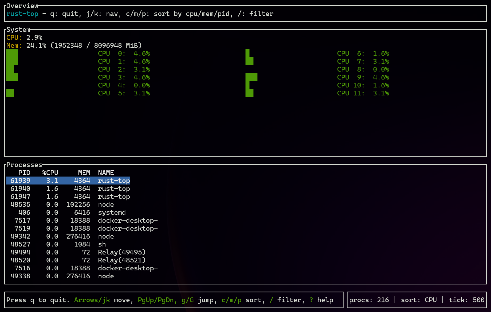

## rust-top

An htop-like terminal process viewer written in Rust using ratatui + crossterm + sysinfo

### Screenshot


### Features
- CPU and memory overview, plus per‑core CPU gauges
- Sortable process list (by CPU, memory, or PID)
- Incremental name filter with live indicator
- Vim-style navigation (j/k) and arrow keys; fast jumps (PgUp/PgDn, g/G)
- Adjustable refresh rate (+/-)
- Help popup (?)

### Install
- From source:
  - Prereqs: Rust toolchain (use `rustup`)
  - Build and run:
    ```bash
    cargo run
    ```
  - Build release binary:
    ```bash
    cargo build --release
    ./target/release/rust-top
    ```

### Usage
- Keys:
  - q / Esc or Ctrl-C: quit
  - j / k or ArrowDown / ArrowUp: move selection
  - PgUp / PgDn, g / G: page/top/bottom
  - c / m / p: sort by CPU / Memory / PID
  - /: start typing to filter by process name; Enter/Esc to finish
  - +/-: adjust refresh rate (100–2000ms)
  - ?: toggle help

### Notes
- Tested on Linux (including WSL2). macOS should work; Windows support depends on terminal capabilities.
- Process listing is capped to 200 rows for responsiveness; this can be adjusted in code.
- Selection is kept stable across refreshes by tracking PID.

### Roadmap
- Load averages and per-core history sparklines
- Process actions: kill/terminate, renice
- Additional columns: user, state, threads, command, time, I/O
- Paging beyond 200 rows and configurable column widths
- Config file for keybindings and defaults

### Project structure
- `src/main.rs`: thin entry that runs the TUI
- `src/app.rs`: application state, sorting, refresh
- `src/tui.rs`: terminal setup and event loop
- `src/ui/`: all rendering (header, system, per-core gauges, process list, footer, help)


